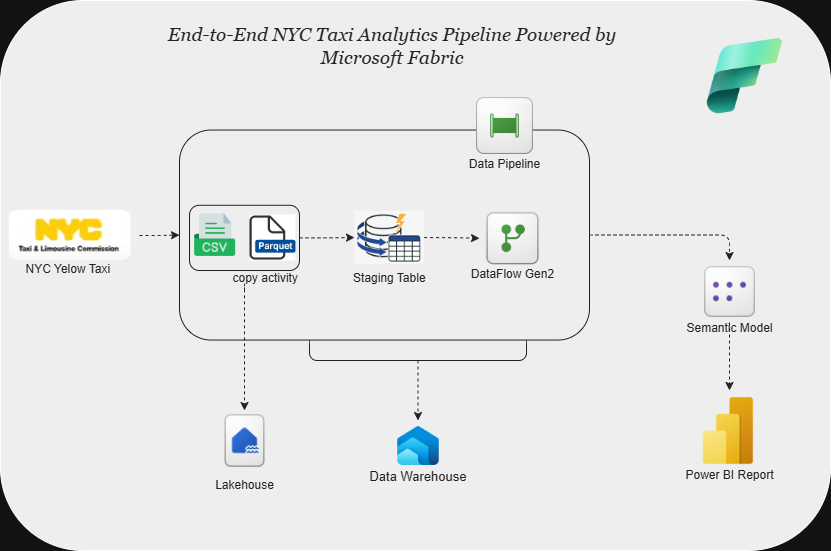

 # Data_Engineering
 
# 🚖 NYC Taxi Data Pipeline — Microsoft Fabric

An end-to-end data engineering solution built on **Microsoft Fabric** to ingest, process, model, and visualize NYC Taxi trip data for analytics and decision-making.

---

## 🧱 Architecture Diagram

---

## 📌 Architecture Overview

| Layer | Technology | Purpose |
|--------|------------|---------|
| **Data Ingestion** | OneLake Landing Zone (Parquet Files) | Store raw NYC Taxi datasets in the data lake |
| **ETL / Orchestration** | Fabric Data Factory (Copy Activity, Dataflows, Stored Procedures) | Transform and stage data across **Bronze → Silver → Gold** layers |
| **Data Modeling** | Power BI Semantic Layer | Define relationships between trip and zone datasets |
| **Analytics & Reporting** | Power BI Dashboards | Deliver insights for **trip trends, revenue metrics, and zone performance** |

---

## ✅ Key Capabilities

- Automated & scalable **lakehouse architecture**
- **Parameterized pipelines** for flexible ingestion and transformation
- Optimized **presentation tables** for BI consumption
- **Interactive dashboards** with drill-down insights by time, borough, vendor, and service type

---

## 📊 Sample Insights Delivered

✔ Identify **busiest pickup and drop-off zones**  
✔ Track **daily / monthly trip volume trends**  
✔ Analyze **revenue by distance, vendor, or payment method**  

---

 
#  [HealthGuide AI Chatbot](https://partyrock.aws/u/Phabulous/lolycf257/HealthGuide-AI)

## Project Description
** HealthGuide AI Chatbot** is designed to be a friendly and accessible resource for users seeking information on general health and wellness topics. Built using  [Amazon PartyRock](https://partyrock.aws/), this chatbot leverages large language models to provide interactive, conversational answers to user queries, helping them learn about nutrition, fitness, common health conditions, and more.

---

##  Features

-  AI-powered health guidance using Amazon PartyRock
-  Covers fitness, nutrition, sleep, and mental health
-  Helps users understand common symptoms and suggests next steps
-  Sends motivational nudges and reminders for hydration, movement, and rest.

---

#  [PromoPulse – AI Promotional Image Generator ](https://partyrock.aws/u/Phabulous/FUSXtxjYF/PromoPulse)

**PromoPulse** is an AI-powered image generator built with [Amazon PartyRock](https://partyrock.aws/), designed to help businesses create stunning, unique marketing visuals in seconds. Whether you're launching a product, promoting a service, or building brand awareness, PromoPulse delivers eye-catching content with zero design experience required.

---

##  Features

- **AI-Driven Visual Generation**
  Uses Amazon PartyRock to generate promotional images based on business concepts and campaign goals.

- **Targeted Marketing Themes**  
  Supports industry-specific prompts (e.g., fashion, tech, food, wellness) for tailored visuals.

-  **Customizable Styles**  
  Choose from modern, minimalist, bold, or playful aesthetics.

-  **High-Resolution Output**  
  Generates crisp, professional-grade images suitable for web and print.

---

